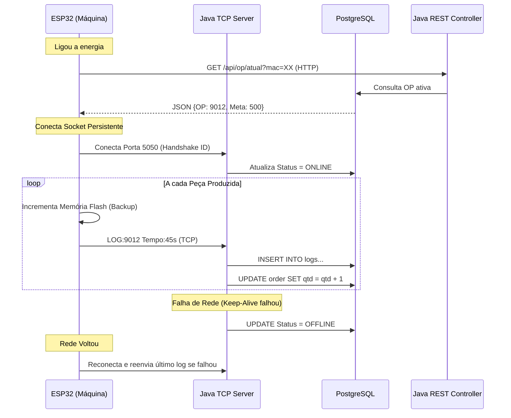

```mermaid

sequenceDiagram
    participant ESP as ESP32 (Máquina)
    participant TCP as Java TCP Server
    participant DB as PostgreSQL
    participant HTTP as Java REST Controller

    Note over ESP: Ligou a energia
    ESP->>HTTP: GET /api/op/atual?mac=XX (HTTP)
    HTTP->>DB: Consulta OP ativa
    DB-->>ESP: JSON {OP: 9012, Meta: 500}
    
    Note over ESP: Conecta Socket Persistente
    ESP->>TCP: Conecta Porta 5050 (Handshake ID)
    TCP->>DB: Atualiza Status = ONLINE

    loop A cada Peça Produzida
        ESP->>ESP: Incrementa Memória Flash (Backup)
        ESP->>TCP: LOG:9012 Tempo:45s (TCP)
        TCP->>DB: INSERT INTO logs...
        TCP->>DB: UPDATE order SET qtd = qtd + 1
    end

    Note over TCP: Falha de Rede (Keep-Alive falhou)
    TCP->>DB: UPDATE Status = OFFLINE
    
    Note over ESP: Rede Voltou
    ESP->>TCP: Reconecta e reenvia último log se falhou

```